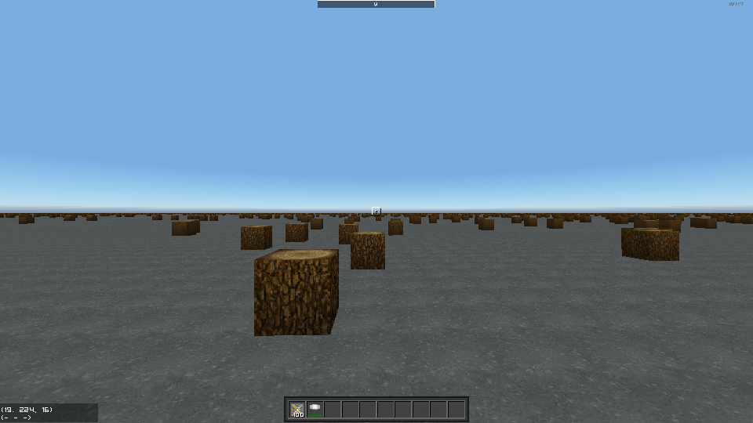

# (Official) C# Modding Documentation

## Pages

- [Home](../index)
- [Terrain Generation Setup](terrain)
- [Terrain Generation Option 1](terrain1)
- [Terrain Generation Optimization Guide](terrain2_opt)

##### **Note:** This guide is a work in progress (WIP) and the Terrain Generation Modding API as described in this guide has not yet been released to public versions of the game.
___

# Terrain Generation

This guide assumes you already have a working mod setup for terrain generation.

See this [linked guide](terrain) if you do not.

## Overview

This guide will show how to implement modded terrain generation by implementing `ITMTerrainGenerator` from scratch.

Open `ModNameTerrainGen.cs` that was created in the [Terrain Gen Setup Guide](terrain.md).

Change:
```cs
public class ModNameTerrainGen : TerrainGenerator
```
to
```cs
public class ModNameTerrainGen : ITMTerrainGenerator
```

Use `Quick Action` to implement the interface:


The code should now look like this:
```cs
class ModNameTerrainGen : ITMTerrainGenerator
{
    public ITMMap Map => throw new System.NotImplementedException();

    public ITMTerrainPreview TerrainPreviewer => throw new System.NotImplementedException();

    public void DecorateChunk(ITMMapChunk chunk)
    {
        throw new System.NotImplementedException();
    }

    public void GenerateChunk(ITMMapChunk chunk)
    {
        throw new System.NotImplementedException();
    }

    public int GetGroundHeight(int globalX, int globalZ)
    {
        throw new System.NotImplementedException();
    }

    public void Initialize(ITMWorld world, ITMMap map, BiomeParams biomeParams)
    {
        throw new System.NotImplementedException();
    }

    public void InitializeForChunk(GlobalPoint3D chunkGlobalOffset, ulong seed)
    {
        throw new System.NotImplementedException();
    }

    public void InitializeForGeneralUse(ITMMapChunk newChunk)
    {
        throw new System.NotImplementedException();
    }

    public void InitializeForGeneralUse(GlobalPoint3D p)
    {
        throw new System.NotImplementedException();
    }

    public void InitializeForPreview(BiomeParams biomeParams, BoxInt mapBound, ushort seaLevel, int seed)
    {
        throw new System.NotImplementedException();
    }

    public void PreGenerateCaves()
    {
        throw new System.NotImplementedException();
    }
}
```

Enter the following edits:

Add a new `map` member field. This will be used in chunk generation later. This field can be set in the `Initialize(ITMWorld, ITMMap, BiomeParams)` method like so:

```cs
ITMMap map;
 
public void Initialize(ITMWorld world, ITMMap map, BiomeParams biomeParams)
{
    this.map = map;
}
```

Update the `ITMMap Map` property to return the `map` field:

```cs
public ITMMap Map => map;
```

Next remove `throw new System.NotImplementedException();` from the following methods:

```cs
public void DecorateChunk(ITMMapChunk chunk)
public void GenerateChunk(ITMMapChunk chunk)
public void InitializeForGeneralUse(ITMMapChunk newChunk)
public void InitializeForGeneralUse(GlobalPoint3D p)
public void PreGenerateCaves()
```

Replace `throw new System.NotImplementedException();` in `GetGroundHeight()` with `return 0;`

___

The code should now look like this:
```cs
class ModNameTerrainGen : ITMTerrainGenerator
{
    ITMMap map;
    public ITMMap Map => map;

    public ITMTerrainPreview TerrainPreviewer => throw new System.NotImplementedException();

    public void DecorateChunk(ITMMapChunk chunk)
    {
    }

    public void GenerateChunk(ITMMapChunk chunk)
    {
    }

    public int GetGroundHeight(int globalX, int globalZ)
    {
        return 0;
    }

    public void Initialize(ITMWorld world, ITMMap map, BiomeParams biomeParams)
    {
        this.map = map;
    }

    public void InitializeForChunk(GlobalPoint3D chunkGlobalOffset, ulong seed)
    {
        throw new System.NotImplementedException();
    }

    public void InitializeForGeneralUse(ITMMapChunk newChunk)
    {
    }

    public void InitializeForGeneralUse(GlobalPoint3D p)
    {
    }

    public void InitializeForPreview(BiomeParams biomeParams, BoxInt mapBound, ushort seaLevel, int seed)
    {
        throw new System.NotImplementedException();
    }

    public void PreGenerateCaves()
    {
    }
}
```

Build your Mod project. Fix any errors.

Copy the assembly (dll) file into the mod's deploy folder (under Saved Games).

Open the Terrain.xml file in the deploy folder and change it to:
```xml
<ModTerrainXML>
  <Name>TerrainFromScratch</Name>
</ModTerrainXML>
```

Run the game and activate your Mod. The `Terrain:` field on the Lobby tab should be `TerrainFromScratch`.

Start the world.

You should be standing at the bottom of an empty world.


## Code Reformat

At this point I'd suggest a slight reformat to the code to place methods in a more logical position within the class file, and to add some `#region` separation.

Change the `ModNameTerrainGen` class code so it now looks like this:
```cs
class ModNameTerrainGen : ITMTerrainGenerator
{
    ITMMap map;
    public ITMMap Map => map;
    public ITMTerrainPreview TerrainPreviewer => throw new System.NotImplementedException();

    #region Initialization

    public void Initialize(ITMWorld world, ITMMap map, BiomeParams biomeParams)
    {
        this.map = map;
    }

    public void InitializeForChunk(GlobalPoint3D chunkGlobalOffset, ulong seed)
    {
        throw new System.NotImplementedException();
    }

    public void InitializeForGeneralUse(ITMMapChunk newChunk)
    {
    }

    public void InitializeForGeneralUse(GlobalPoint3D p)
    {
    }

    public void InitializeForPreview(BiomeParams biomeParams, BoxInt mapBound, ushort seaLevel, int seed)
    {
        throw new System.NotImplementedException();
    }

    public void PreGenerateCaves()
    {
    }

    #endregion

    #region Generation

    public void GenerateChunk(ITMMapChunk chunk)
    {
    }

    #endregion

    #region Decoration

    public void DecorateChunk(ITMMapChunk chunk)
    {
    }

    #endregion

    #region Implementation

    public int GetGroundHeight(int globalX, int globalZ)
    {
        return 0;
    }

    #endregion
}
```

## Generation

Total Miner generates its terrain chunk by chunk. Each chunk contains a 3D grid (32 x 32 x 32) of voxels. Therefor a 512 x 512 x 512 size world would have 16 x 16 x 16 of these chunks. A 2048 x 512 x 2048 size world would have 64 x 16 x 64 of these chunks.

The game determines the chunks that require generation at any given time and for each it calls the `GenerateChunk(ITMMapChunk chunk)` method on the current `ITerrainGenerator` implementation. As a terrain generation modder, you write code in the `GenerateChunk()` method to put blocks (voxels) into each chunk as your terrain requires.

The `GenerateChunk()` method is passed an `ITMChunk` reference.

The `ITMChunk` interface does not give many options for writing voxel data. There are just 3 `Fill` methods which support filling regions of the chunk with voxel data.

For this guide we will use a fill method to completely fill chunks with Basalt that are positioned below height 225 (on the Y axis), effectively making the ground level a flat 224.

Add this code to the `GenerateChunk()` method.
```cs
public void GenerateChunk(ITMMapChunk chunk)
{
    // just fill in the whole chunk with Basalt if it is below the map height of 224
    if (chunk.GlobalOffset.Y < 224)
        chunk.Fill(new MapBlock() { BlockID = (byte)Block.Basalt }, ChunkFlags.None);
}
```

And change the `GetGroundHeight()` method to this:
```cs
public int GetGroundHeight(int globalX, int globalZ) => 224;
```

Build your mod and run the game. Activate your mod and you should see this when you start the world.


## Writing Voxel Data

The `Fill` methods on the `ITMChunk` interface are good for writing blocks of voxels, but they are not efficient enough for writing thousands of voxels individually.

Since we are generating terrain, we don't need to access the existing voxel data, we can just create out own array, generate voxel data into the array and then commit that array as the chunks voxel data (and thereby replacing any existing voxel data for the chunk).

Declare a member field `byte[] blockCache` (you can insert it under the `ITMMap map` field). We will generate voxel data directly into this array.

For this tutorial we are going to generate random tree stumps onto the ground. To do that we need a pseudo random number generator (PRNG). We can use the same PRNG type that Total Miner uses.

Declare a member field `PcgRandom random` and insert it under `byte[] blockCache`.

Change the `GenerateChunk()` method to this:

```cs
public void GenerateChunk(ITMMapChunk chunk)
{
    // just fill in the whole chunk with Basalt if it is below the map height of 224
    if (chunk.GlobalOffset.Y < 224)
    {
        chunk.Fill(new MapBlock() { BlockID = (byte)Block.Basalt }, ChunkFlags.None);
        return; // nothing more to do so return
    }
            
    // if this is a ground level chunk (sea level)
    if (chunk.GlobalOffset.Y == 224)
    {
        if (random == null)
            // random is null the first time this generator object is used
            random = new PcgRandom((ulong)map.Seed, (ulong)chunk.GlobalOffset.GetHashCode());
        else
            // if random was instantiated before, it was for a different chunk, so reseed it to this chunks seed
            random.Seed((ulong)map.Seed, (ulong)chunk.GlobalOffset.GetHashCode());

        // only populate wood into half of the chunks
        if (random.Next(2) == 0)
        {
            if (blockCache == null)
                // create the voxel cache if not yet created
                blockCache = new byte[map.ChunkLength];
            else
                // reset the cache if already created
                Array.Clear(blockCache);
        }
    }
}
```

The first difference is the method returns immediately after filling chunks below 224 with Basalt.

Next we test the chunks bottom Y coord, and if it is 224 (our ground/sea level) then we will generate random tree stumps into it, otherwise the chunk is above so we will treat it as 'sky' and generate nothing.

We use a ground level of 224 because it is a multiple of 32 which is the height of each chunk, so it makes it easier as we can just completely fill any chunks below it with Basalt, and then generate the tree stumps into level 0 (local Y coord) of the surface level chunks.

There will be 32 x 32 surface level chunks on a 1024 x 1024 size world.

## Tree Stumps and Mushrooms

Build your mod and fix any errors. You can run the game and use the mod but you'll still just see the Basalt as we haven't written the tree stump voxels yet.

If the bottom Y coord of the chunk is 224, then we will generate tree stumps in these chunks.

First we check if the PRNG is null. If it is null we instantiate it with a chunk unique seed (map seed + chunk hash code) otherwise if the PRNG has already been instantiated then we just reseed it using the map seed + chunk hash. The reason we do this is the TerrainGenerator objects are reused by the terrain system for efficiency so member variables will have their values from previous use. Any previous use will have been for a different chunk so that is why we must reseed the PRNG with the current chunks hash.

We only want to generate tree stumps into half of the surface chunks so we do a `if (random.Next(2) == 0)` test.

Next we do a similar thing with blockCache. If it is null then this is the first time this generator object has been used by the terrain system so we need to instantiate the array. `map.ChunkLength` returns the # of voxels in a chunk (typically 32x32x32=32k). That is the size of the array we want.

If the generator has already been used then blockCache will have already been instantiated, but it will contain voxel data from the last use, which we need to clear out before we do generation for the current chunk, so we call `Array.Clear(blockCache)`.

Now we are ready to generate the tree stumps.

Grab a random count of stumps to generate for this chunk (between 10 and 29 incl):
```cs
int count = random.Next(10, 30);
```
Loop for the # of stumps:
```cs
for (int i = 0; i < count; ++i)
{
```
Pick a random x and z (local) position within the chunk:
```cs
int x = random.Next(map.ChunkSize.X);
int z = random.Next(map.ChunkSize.Z);
```
Calculate the index into the array for the x, z position:
```cs
int j = x + (z * map.ChunkSize.X); // y = 0 implied
```
Write the `tree stump` voxel into the array:
```cs
blockCache[j] = (byte)Block.Wood;
```

Now we have generated our tree stumps, we can commit the voxel data to the chunk, and we are done.

Remember underlying voxel data is stored as run length encoded streams for compression.

To compress and commit our local voxel array to an RLE stream for the chunk we call:
```cs
((MapChunk)chunk).BlockData.CompressNoLockNoCCM(blockCache);
```

NoLock means it is a thread safe and lock free operation. NoCCM means it is not using the games `ChunkCacheManager` which is a reusable voxel cache manager.

And that is it. We have committed the voxel data and if you build and run your mod you should now see something like this:



If you are getting build errors, the full source should look like this:

```cs
using StudioForge.BlockWorld;
using StudioForge.Engine.Core;
using StudioForge.TotalMiner;
using StudioForge.TotalMiner.API;
using System;

namespace TerrainGuide2
{
    class TerrainGuideTerrainGen : ITMTerrainGenerator
    {
        ITMMap map;
        PcgRandom random;
        byte[] blockCache;

        public ITMMap Map => map;
        public ITMTerrainPreview TerrainPreviewer => throw new System.NotImplementedException();

        #region Initialization

        public void Initialize(ITMWorld world, ITMMap map, BiomeParams biomeParams)
        {
            this.map = map;
        }

        public void InitializeForChunk(GlobalPoint3D chunkGlobalOffset, ulong seed)
        {
            throw new System.NotImplementedException();
        }

        public void InitializeForGeneralUse(ITMMapChunk newChunk)
        {
        }

        public void InitializeForGeneralUse(GlobalPoint3D p)
        {
        }

        public void InitializeForPreview(BiomeParams biomeParams, BoxInt mapBound, ushort seaLevel, int seed)
        {
            throw new System.NotImplementedException();
        }

        public void PreGenerateCaves()
        {
        }

        #endregion

        #region Generation

        public void GenerateChunk(ITMMapChunk chunk)
        {
            // just fill in the whole chunk with Basalt if it is below the map height of 224
            if (chunk.GlobalOffset.Y < 224)
            {
                chunk.Fill(new MapBlock() { BlockID = (byte)Block.Basalt }, ChunkFlags.None);
                return;
            }
            
            if (chunk.GlobalOffset.Y == 224)
            {
                if (random == null)
                    // random is null the first time this generator object is used
                    random = new PcgRandom((ulong)map.Seed, (ulong)chunk.GlobalOffset.GetHashCode());
                else
                    // if random was instantiated before, it was for a different chunk, so reseed it to this chunks seed
                    random.Seed((ulong)map.Seed, (ulong)chunk.GlobalOffset.GetHashCode());

                // only populate wood into half of the chunks
                if (random.Next(2) == 0)
                {
                    if (blockCache == null)
                        // create the voxel cache if not yet created
                        blockCache = new byte[map.ChunkLength];
                    else
                        // reset the cache if already created
                        Array.Clear(blockCache);

                    // populate somewhere between 10 and 30 wood 'stumps' for each chunk
                    int count = random.Next(10, 30);
                    for (int i = 0; i < count; ++i)
                    {
                        // pick a random x, z position within the chunk
                        int x = random.Next(map.ChunkSize.X);
                        int z = random.Next(map.ChunkSize.Z);
                        int j = x + (z * map.ChunkSize.X); // y = 0 implied
                        blockCache[j] = (byte)Block.Wood; // y=0 is the bottom plane of the chunk
                    }

                    // the voxel data is now written so we must commit it back to a
                    // compressed RLEStream which is the underlying voxel storage
                    // we must cast ITMChunk to MapChunk to compress to the RLEStream
                    ((MapChunk)chunk).BlockData.CompressNoLockNoCCM(blockCache);
                }
            }
        }

        #endregion

        #region Decoration

        public void DecorateChunk(ITMMapChunk chunk)
        {
        }

        #endregion

        #region Implementation

        public int GetGroundHeight(int globalX, int globalZ) => 224;

        #endregion
    }
}
```

## Lighting

If you look closely at the base of the tree stumps you will notice there is no lighting or shading, everything is full brightness.

To make this more apparent we will change the shape of the tree stumps into tree mushrooms which will cause more obvious shading.

Replace:
```cs
blockCache[j] = (byte)Block.Wood; // y=0 is the bottom plane of the chunk
```
With:
```cs
// don't generate if near chunk edge
if (x > 2 && x < map.ChunkSize.X - 3 && z > 2 && z < map.ChunkSize.Z - 3)
{
    // write the mushroom 'trunk'
    blockCache[GetChunkIndex(x, 0, z)] = (byte)Block.Wood; // y=0 is the bottom plane of the chunk

    // write the 5 x 5 mushroom 'roof'
    for (int xx = x - 2; xx < x + 3; ++xx)
        for (int zz = z - 2; zz < z + 3; ++zz)
            blockCache[GetChunkIndex(xx, 1, zz)] = (byte)Block.Wood;
    }
}
```
And add the following helper method in the `implementation` region:
```cs
int GetChunkIndex(int x, int y, int z) => x + (z * map.ChunkSize.X) + (y * map.ChunkSize.X * map.ChunkSize.Z);
```

Build and run and you should see something like this:


Now run `Rebuild Local Light` on the Pause Menu => Graphics tab.

After a few seconds it will update the lighting and will look something like this:


You can clearly see the lighting/shading in the second image.

We need to do three things to ensure the game will properly update the lighting/shading for chunks we generate:
1. We must set a flag on the chunk to indicate it must be lit.
1. We must ensure the world `Height Map` is correctly updated. The lighting system depends on the height map.
1. Set the SeaLevel property in Terrain.xml

These steps are relatively easy:

To set the lighting flag insert the following code after the `CompressNoLockNoCCM()` call:
```cs
chunk.SetChunkFlag(ChunkFlags.LightDirty);
```

And to update the `Height Map` insert the following code after `blockCache[GetChunkIndex(xx, 1, zz)] = (byte)Block.Wood;` (mushroom roof):
```cs
ushort h = (ushort)(1 + chunk.GlobalOffset.Y);
chunk.Region.HeightMap.SetHeight(xx + chunk.GlobalOffset.X, zz + chunk.GlobalOffset.Z, h, h);
```

For each voxel we write at the top of the tree mushroom we tell the map it is the highest voxel in the world. We add `chunk.GlobalOffset` because `SetHeightMap()` requires world coords.

The chunk immediately under the tree mushrooms has the ground level Basalt, so it will also need a lighting update due to the tree mushrooms above, so we must also set it's flag. To get the down neighbour chunk we first must cast to `MapChunk`:
```cs
((MapChunk)chunk).DownNeighbour().SetChunkFlag(ChunkFlags.LightDirty);
```

Finally edit `Terrain.xml` in the mods deploy folder and add the SeaLevel property:
`<SeaLevel>224</SeaLevel>`  // note the capital L

Build and run the game/mod. It should now update the lighting appropriately.

___

Here is the full source:
```cs
using StudioForge.BlockWorld;
using StudioForge.Engine.Core;
using StudioForge.TotalMiner;
using StudioForge.TotalMiner.API;
using System;

namespace TerrainGuide2
{
    class TerrainGuideTerrainGen : ITMTerrainGenerator
    {
        ITMMap map;
        PcgRandom random;
        byte[] blockCache;

        public ITMMap Map => map;
        public ITMTerrainPreview TerrainPreviewer => throw new System.NotImplementedException();

        #region Initialization

        public void Initialize(ITMWorld world, ITMMap map, BiomeParams biomeParams)
        {
            this.map = map;
        }

        public void InitializeForChunk(GlobalPoint3D chunkGlobalOffset, ulong seed)
        {
            throw new System.NotImplementedException();
        }

        public void InitializeForGeneralUse(ITMMapChunk newChunk)
        {
        }

        public void InitializeForGeneralUse(GlobalPoint3D p)
        {
        }

        public void InitializeForPreview(BiomeParams biomeParams, BoxInt mapBound, ushort seaLevel, int seed)
        {
            throw new System.NotImplementedException();
        }

        public void PreGenerateCaves()
        {
        }

        #endregion

        #region Generation

        public void GenerateChunk(ITMMapChunk chunk)
        {
            // just fill in the whole chunk with Basalt if it is below the map height of 224
            if (chunk.GlobalOffset.Y < 224)
            {
                chunk.Fill(new MapBlock() { BlockID = (byte)Block.Basalt }, ChunkFlags.None);
                return;
            }
            
            if (chunk.GlobalOffset.Y == 224)
            {
                if (random == null)
                    // random is null the first time this generator object is used
                    random = new PcgRandom((ulong)map.Seed, (ulong)chunk.GlobalOffset.GetHashCode());
                else
                    // if random was instantiated before, it was for a different chunk, so reseed it to this chunks seed
                    random.Seed((ulong)map.Seed, (ulong)chunk.GlobalOffset.GetHashCode());

                // only populate wood into half of the chunks
                if (random.Next(2) == 0)
                {
                    if (blockCache == null)
                        // create the voxel cache if not yet created
                        blockCache = new byte[map.ChunkLength];
                    else
                        // reset the cache if already created
                        Array.Clear(blockCache);

                    // populate somewhere between 10 and 30 wood 'tables' for each chunk
                    int count = random.Next(10, 30);
                    for (int i = 0; i < count; ++i)
                    {
                        // pick a random x, z position within the chunk
                        int x = random.Next(map.ChunkSize.X);
                        int z = random.Next(map.ChunkSize.Z);

                        // don't generate if near chunk edge
                        if (x > 2 && x < map.ChunkSize.X - 3 && z > 2 && z < map.ChunkSize.Z - 3)
                        {
                            // write the mushroom 'trunk'
                            blockCache[GetChunkIndex(x, 0, z)] = (byte)Block.Wood; // y=0 is the bottom plane of the chunk

                            // write the 5 x 5 mushroom 'roof'
                            for (int xx = x - 2; xx < x + 3; ++xx)
                            {
                                for (int zz = z - 2; zz < z + 3; ++zz)
                                {
                                    blockCache[GetChunkIndex(xx, 1, zz)] = (byte)Block.Wood;
                                    ushort h = (ushort)(1 + chunk.GlobalOffset.Y);
                                    chunk.Region.HeightMap.SetHeight(xx + chunk.GlobalOffset.X, zz + chunk.GlobalOffset.Z, h, h);
                                }
                            }
                        }
                    }

                    // the voxel data is now written so we must commit it back to a
                    // compressed RLEStream which is the underlying voxel storage.
                    // we must cast ITMChunk to MapChunk to compress to the RLEStream
                    ((MapChunk)chunk).BlockData.CompressNoLockNoCCM(blockCache);

                    // we have written voxel data into this chunk, so flag it as needing a lighting update
                    chunk.SetChunkFlag(ChunkFlags.LightDirty);

                    // the voxels we have written will require the chunk below to also have its lighting updated
                    ((MapChunk)chunk).DownNeighbour().SetChunkFlag(ChunkFlags.LightDirty);
                }
            }
        }

        #endregion

        #region Decoration

        public void DecorateChunk(ITMMapChunk chunk)
        {
        }

        #endregion

        #region Implementation

        int GetChunkIndex(int x, int y, int z) => x + (z * map.ChunkSize.X) + (y * map.ChunkSize.X * map.ChunkSize.Z);

        public int GetGroundHeight(int globalX, int globalZ) => 224;

        #endregion
    }
}
```

This is the end of the guide for now.

You might notice the terrain generation presented in this guide runs quite slowly. Fast terrain generation is very important for immersion. See the optimization guide below for ways you can make it run faster.

Good luck Total Terra Former!

- [Home](../index)
- [Terrain Generation Optimization Guide](terrain2_opt)