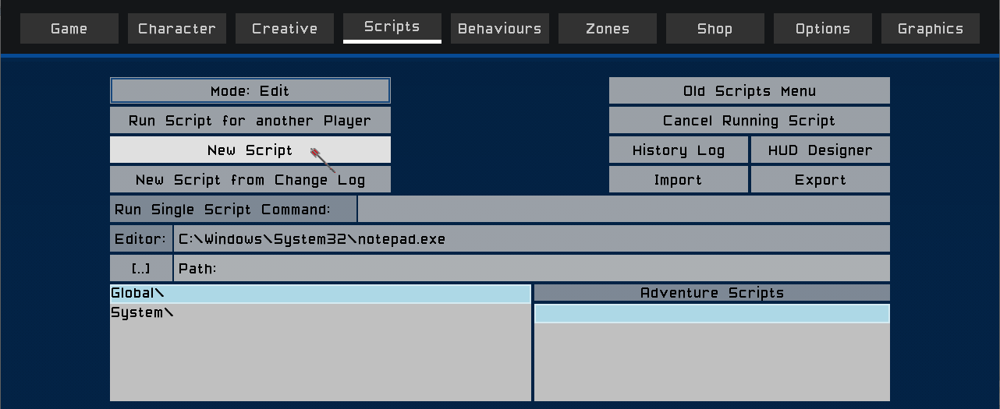
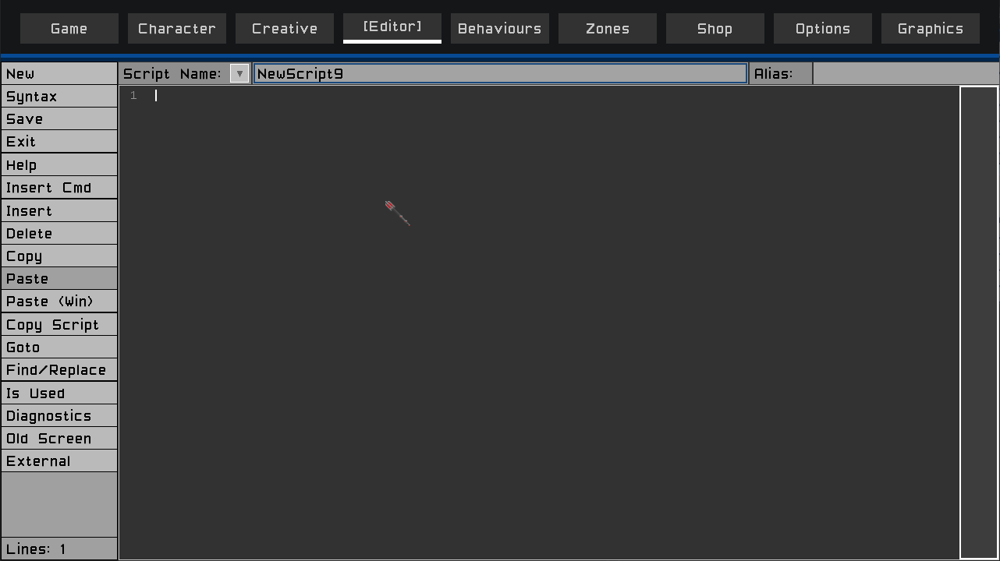
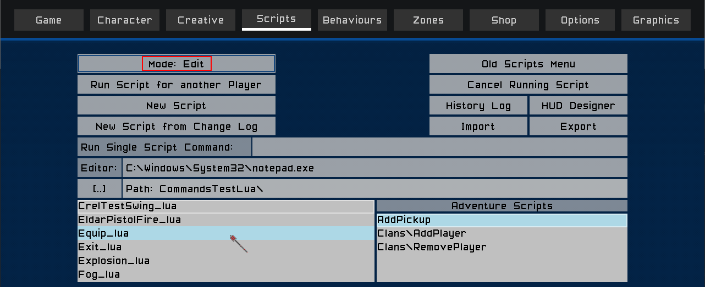
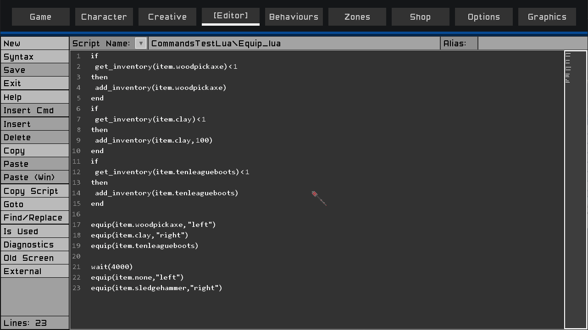

# TM Lua Tutorial - The Script Editor

This tutorial will go through the main features of the script editor.

### Contents

- [Creating a new script](#creating-a-new-script)
- [Editing an existing script](#editing-an-existing-script)
- [Saving a script](#contents)
- [General text editing](#contents)
- [Hot keys](#contents)
- [Code completion](#contents)
- [Using the built in Help documentation](#contents)
- [Inserting a new command / function call](#contents)
- [Deleting text](#contents)
- [Copying / Pasting text](#contents)
- [Copying an entire script](#contents)
- [Goto line or script](#contents)
- [Find / Replace text](#contents)
- [Script diagnostics](#contents)
- [Using an external editor](#contents)
- [Using the old script editor](#contents)
- [Back to Main Tutorial page](../lua-tut)

___

## Creating a New script

To create a new script, click the `New Script` button.

The editor will open with an empty script.

Click anywhere in the gray editor area to start entering your script.

#### [Back To Top](#contents)

___

## Editing an Existing script

To edit/change an existing script, ensure the `Mode` button is set to `Mode:Edit` and then click the script you want to edit in the main list.

The editor will open with the script loaded, and you can start editing the script.

#### [Back To Top](#contents)

___
