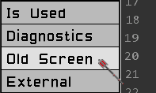
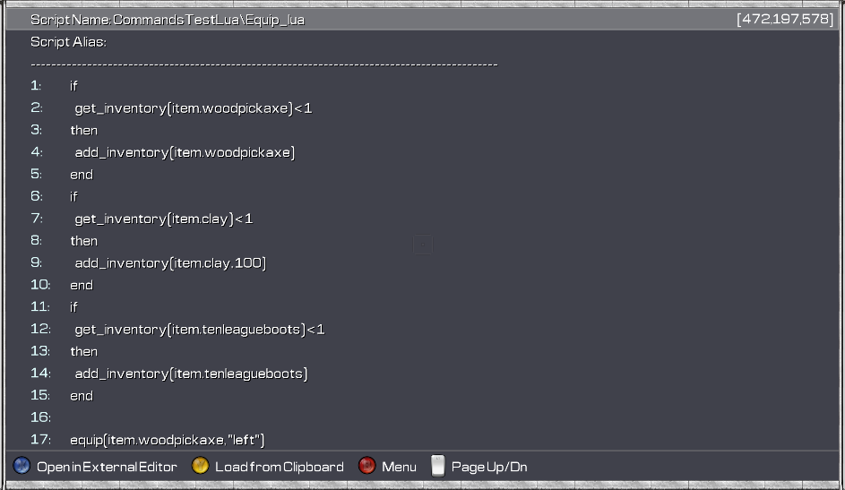

# TM Lua Tutorial - The Script Editor

This tutorial will go through the main features of the script editor.

### Contents

- [Creating a new script](#creating-a-new-script)
- [Editing an existing script](#editing-an-existing-script)
- [Saving a script](#saving-a-script)
- [Editor keys](#editor-keys)
- [Using the old script editor](#using-the-old-script-editor)

To be added:
- [General text editing](#contents)
- [Code completion](#contents)
- [Using the built in Help documentation](#contents)
- [Inserting a new command / function call](#contents)
- [Deleting text](#contents)
- [Copying / Pasting text](#contents)
- [Copying an entire script](#contents)
- [Goto line or script](#contents)
- [Find / Replace text](#contents)
- [Script diagnostics](#contents)
- [Using an external editor](#contents)
- [Back to Main Tutorial page](../lua-tut)

___

## Creating a New script

To create a new script, click the `New Script` button.

The editor will open with an empty script.

Click anywhere in the gray editor area to start entering your script.

#### [Back To Top](#contents)

___

## Editing an Existing script

To edit/change an existing script, ensure the `Mode` button is set to `Mode:Edit` and then click the script you want to edit in the main list.

The editor will open with the script loaded, and you can start editing the script.

#### [Back To Top](#contents)

___

## Saving a script

To save a new script or to save edits to an existing script, either click the `Save` button on the `Tool Pane` or press the `<ctrl-s>` keys.

If the `Save` button on the `Tool Pane` is disabled, then there are no edits to save.

When edits to an existing script are saved, if there is an instance of that script currently executing, that instance will be cancelled.

After a script is saved, it is not recompiled. It will only be recompiled the next time it is executed.

Saving a script in the edtior does not save the script to disk or permanent storage, it just makes it the current version of the script that will be executed during this game session. Scripts are saved to permanent storage as part of the world save on the `Game` tab.

If there are unsaved edits to a script when exiting the editor, a message box will prompt you to either `Save` or `Discard` the changes.

#### [Back To Top](#contents)

___

## Editor Keys

- `<Enter>` - Start / insert a new line. If the carot is in the middle of a line, the line will be split at the carot positiion and the text to the right will be moved down to a new line.
- `<Backspace>` - Delete selected text (if any) otherwise delete the character to the left of the carot. If the carot is at the beginngin of a line, the line is appended to the previous line.
- `<Delete>` - Delete all selected lines (if any), otherwise delete selected text (if any) otherwise delete the character to the right of the carot. If the carot is at the end of a line, the following line will be appended to the current line.
- `<Shift-Delete>` - Delete all selected lines (if any), otherwise delete the whole line.
- `<Shift-Insert>` - Insert a new line. The line the carot is on will be moved down.

### Navigation

- `<Home>` - Move the carot to the beginning of the line.
- `<End>` - Move the carot to the end of the line.
- `<Up>` - Move the carot up to the previous line.
- `<Down>` - Move the carot down to the next line.
- `<PgUp>` - Move the carot up one page.
- `<PgDn>` - Move the carot down one page.
- `<Left>` - Move the carot one character to the left. If the carot is at the beginning of the line, it will be moved to the end of the previous line.
- `<Right>` - Move the carot one character to the right. If the carot is at the end of the line, it will be moved to the beginning of the next line.
- `<Ctrl-Left>` - Move the carot one word to the left.
- `<Ctrl-Right>` - Move the carot one word to the right.
- `<Shift>` - Hold while pressing `<Home>, <End>, <Left> or <Right>` to select text.

### Hot Keys

- `<Esc>` - Exit the editor.
- `<Ctrl-X>` - Exit the editor.
- `<Ctrl-S>` - Save the script.
- `<Ctrl-J>` - Force open Code Completion.
- `<F1>` - Open the Help screen.
- `<F>` - Open the Find / Replace dialog.

#### [Back To Top](#contents)

___

## Using the Old Script Editor

If you prefer to use the old script editor screen, click the `Old Screen` button on the `Tool Pane` and the old script editor will be opened with the currently loaded script.

NB. The old script editor has specific support for editing scripts in the old TM script syntax, but does not have support for writing scripts in Lua.

#### [Back To Top](#contents)

___
