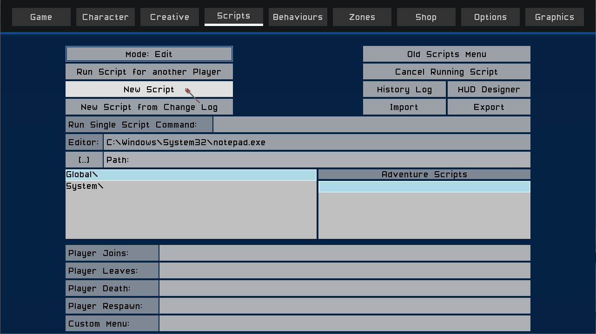

# TM Lua Tutorial - Getting Started

To create a TM lua script, open the `Pause Menu` and open the `Scripts` tab.

Click the `New Script` button.

The Script Editor will open with an empty script.

Click in the `Script Name` field.

Enter `MyFirstScript_lua`

Then press the `<enter>` key.

All scripts that use the Lua programming language, their name must end with `_lua`

Now click anywhere in the gray area and you should see the carot blinking to the right of line 1 in the script editor.

You can now enter a script command.

We will create the usual `Hello World` for our first script.

At the carot, type:

`notify("Hello World")`

And click the Save button.

And there you have it. You have written your first script.

Now let's execute your script.

Click the 'Exit' button, or press the `Esc` key.

You should now be back at the Scripts Menu, and you should see your script listed in the main script list.

Click the `Mode:Edit` button once and it should now say `Mode:Run`

Next click your script in the list.

The `Pause Menu` will close, and the script will be executed.

Congratulations, you have written and executed your first script.

The [notify](../../lua/functions/other/notify.md) function is one of many built in functions at your disposal when writing scripts to enhance your Total Miner worlds. See [here](../../lua/functions.md) for the TM Lua function reference.

It is the main way to communicate information to players.

It is also very useful to script writers as a tool for understanding what values are stored in variables when trying to find problems in scripts.

___

### [Back to Tutorials](../lua-tut)